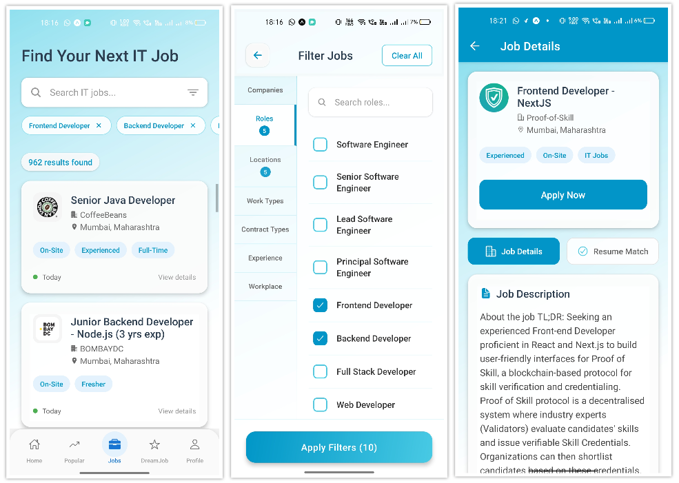
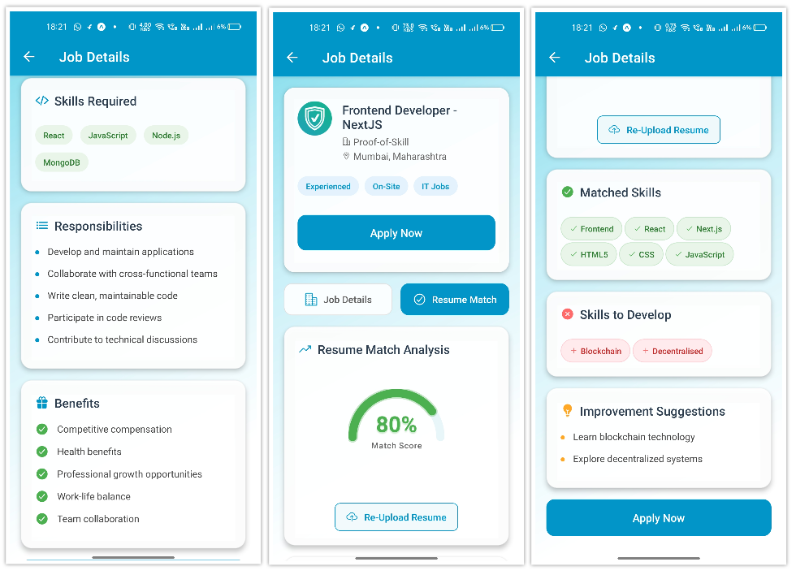

 # JobAlign: Your Personal AI-Powered Career Navigator

🚀 **Live Project | AI-Powered | Real-Time Features | Full Authentication | Modern UI**

> Transform your career journey with personalized roadmaps, trending jobs, resume optimization, and instant AI guidance—all in one seamless mobile app.

---

## About The Project

**JobAlign** is a next-generation, AI-powered mobile application designed to revolutionize the job search and career development experience. With a focus on personalization, intelligence, and user-friendliness, JobAlign empowers users to:
- Discover trending jobs and roles
- Build a tailored skill roadmap for their dream job
- Assess their readiness with real-time quizzes
- Optimize their resume for ATS systems
- Get instant career advice from an AI chatbot

All features are wrapped in a beautiful, modern interface that makes career growth engaging and accessible.

---

## Application Flow

JobAlign guides users through a seamless journey:

### 1. Authentication
**Login / Signup / Forgot Password**
- Secure, intuitive onboarding with modern UI and robust validation.
- Fast registration, easy login, and hassle-free password recovery.

  

### 2. Home Dashboard
- Personalized dashboard showing your career journey, recent activities, and quick access to all features.
- Motivational design to keep users engaged and focused.

  

### 3. Trending Jobs
- Real-time analytics of the most popular and in-demand roles.
- Explore job details, requirements, and market trends to make informed decisions.

  
  

### 4. Job Listings & Filters
- Advanced job search with smart filters for location, role, and skills.
- Clean, informative listings for confident applications.

  
  

### 5. Roadmap
- Visualize a personalized skill roadmap for your dream job.
- Track your progress, explore required topics, and follow a clear path to career success.

  

### 6. Real-Time Quiz
- Interactive quizzes to assess your readiness and master new skills.
- Instant feedback and score tracking for continuous improvement.

  

### 7. Profile
- Manage personal information, track your career progress, and view saved jobs.
- Empowering users to take control of their journey.

  

### 8. ATS Score
- Instantly check how your resume matches job requirements.
- Get actionable tips to improve your chances and pass automated screening systems.

  

### 9. Chatbot
- 24/7 AI-powered career assistant for advice, skill suggestions, and Q&A.
- Conversational interface powered by advanced generative AI.

  

---

🌟 **Why JobAlign?**
- Real-time job analytics and recommendations
- Secure, user-friendly authentication
- Personalized skill development and quizzes
- ATS resume scoring for better job matches
- 24/7 AI chatbot for career support

---

## Built With

           

- **React Native & Expo**: Fast, beautiful, and cross-platform mobile experience
- **Node.js & Express.js**: Robust backend and RESTful API
- **MongoDB**: Flexible, scalable database
- **Google Generative AI**: Smart chatbot and career insights
- **Cloudinary**: Secure resume storage and management

---

## Get Started

### Prerequisites

Make sure you have the following installed on your machine:

-   Node.js (v18 or later)
-   npm or yarn
-   MongoDB (local instance or a cloud-hosted one like MongoDB Atlas)
-   Expo Go app on your mobile device
-   Modern smartphone (iOS/Android)
-   Internet connection

---

## More Information, Guidance & Support

This is a live project built using MERN stack with full authentication, real-time features, and a clean UI.

For any inquiries or support, please reach out via the following channels:
- Email: saichanduadapa951@gmail.com
- LinkedIn: [Saichandu Adapa](https://www.linkedin.com/in/saichandu-adapa-123456789/)

---

